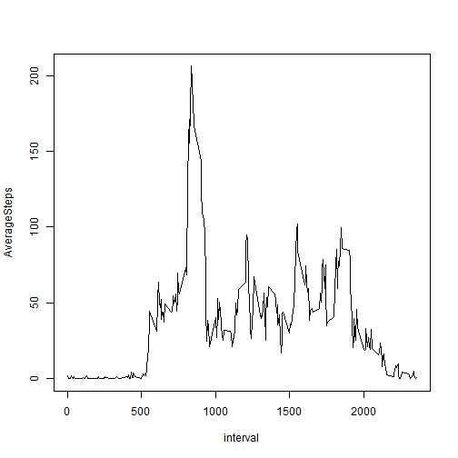

# Reproducible Research: Peer Assessment 1

## Loading and preprocessing the data

#### Loading Data: activity data is unzipped and placed in ./activity/ directory

```r
fd <- './activity/'
fp <- paste(fd,'activity.csv', sep='')
activity <-read.csv(file=fp)
head(activity)
```

```
##   steps       date interval
## 1    NA 2012-10-01        0
## 2    NA 2012-10-01        5
## 3    NA 2012-10-01       10
## 4    NA 2012-10-01       15
## 5    NA 2012-10-01       20
## 6    NA 2012-10-01       25
```

```r
library(lubridate)
```

```
## Warning: package 'lubridate' was built under R version 3.1.1
```

```r
activity$date<- ymd(activity$date)
```

## What is mean total number of steps taken per day?
#### Summary by Date

```r
sumStepByDate <- data.frame(with(activity, tapply(steps, date, sum, na.rm=T, simplify = T)))
names(sumStepByDate) <- c('TotalSteps')
sumStepByDate$Date <- rownames(sumStepByDate)
library(lubridate)
sumStepByDate$Date <- ymd(sumStepByDate$Date)
str(sumStepByDate$Date)
```

```
##  POSIXct[1:61], format: "2012-10-01" "2012-10-02" "2012-10-03" "2012-10-04" ...
```
#### Histogram of Total Number of Steps Taken Per Day

```r
hist(x=sumStepByDate$TotalSteps, main='Distribution of Total Number\n of Steps Taken Each Day')
```

 

#### Mean and Median Total Number of Steps Taken Per Day

```r
# Mean Value
mean(x=sumStepByDate$TotalSteps, na.rm = T)
```

```
## [1] 9354
```

```r
# Median Value
median(x=sumStepByDate$TotalSteps, na.rm = T)
```

```
## [1] 10395
```


## What is the average daily activity pattern?
#### Summary by Interval

```r
AverageStepByInterval <- data.frame(with(activity, tapply(steps, interval, mean, na.rm=T, simplify = T)))
names(AverageStepByInterval) <- c('AverageSteps')
AverageStepByInterval$interval <- rownames(AverageStepByInterval)
str(AverageStepByInterval$interval)
```

```
##  chr [1:288] "0" "5" "10" "15" "20" "25" "30" "35" ...
```

#### Time Series Plot of the 5-minute interval and the average number of steps taken, averaged across all days

```r
with(AverageStepByInterval, plot(AverageSteps~interval, type="l"))
```

 

#### 5-minute interval contains the maximum number of steps

```r
ind<-with(AverageStepByInterval, which(AverageSteps == max(AverageSteps)))
AverageStepByInterval[ind,]
```

```
##     AverageSteps interval
## 835        206.2      835
```

## Imputing missing values

#### Total Number of Missing Values

```r
cntNA = sum(is.na(activity$steps))
allCnt = nrow(activity)
rNA = cntNA / allCnt
sprintf("Number of Missing %d    Portion of Missing Observations %f", cntNA, rNA)
```

```
## [1] "Number of Missing 2304    Portion of Missing Observations 0.131148"
```

#### Filling missing Data using average of 5-minute interval

```r
# get the average step of 5-minute interval and replace NA with it
activity_cleaned <- merge(activity, AverageStepByInterval, by.x="interval", by.y = "interval", all=T)
activity_cleaned$steps[is.na(activity_cleaned$steps)] <- activity_cleaned$AverageSteps[is.na(activity_cleaned$steps)]
activity_cleaned<-activity_cleaned[,c(1,2,3)]

# sort data by date and interval
activity_cleaned<-with(activity_cleaned, activity_cleaned[order(date,interval),])

# some checking with original activity
activity[2014:2020,]
```

```
##      steps       date interval
## 2014     0 2012-10-07     2345
## 2015     0 2012-10-07     2350
## 2016     0 2012-10-07     2355
## 2017    NA 2012-10-08        0
## 2018    NA 2012-10-08        5
## 2019    NA 2012-10-08       10
## 2020    NA 2012-10-08       15
```

```r
activity_cleaned[2014:2020,]
```

```
##       interval  steps       date
## 17428     2345 0.0000 2012-10-07
## 17484     2350 0.0000 2012-10-07
## 17564     2355 0.0000 2012-10-07
## 58           0 1.7170 2012-10-08
## 89           5 0.3396 2012-10-08
## 159         10 0.1321 2012-10-08
## 199         15 0.1509 2012-10-08
```

```r
AverageStepByInterval[1:5,]
```

```
##    AverageSteps interval
## 0       1.71698        0
## 5       0.33962        5
## 10      0.13208       10
## 15      0.15094       15
## 20      0.07547       20
```

#### Summary by Date

```r
sumStepByDate <- data.frame(with(activity_cleaned, tapply(steps, date, sum, na.rm=T, simplify = T)))
names(sumStepByDate) <- c('TotalSteps')
sumStepByDate$Date <- rownames(sumStepByDate)
library(lubridate)
sumStepByDate$Date <- ymd(sumStepByDate$Date)
str(sumStepByDate$Date)
```

```
##  POSIXct[1:61], format: "2012-10-01" "2012-10-02" "2012-10-03" "2012-10-04" ...
```

#### Histogram of Total Number of Steps Taken Per Day

```r
hist(x=sumStepByDate$TotalSteps, main='Distribution of Total Number\n of Steps Taken Each Day')
```

 

#### Mean and Median Total Number of Steps Taken Per Day

```r
# Mean Value
mean(x=sumStepByDate$TotalSteps, na.rm = F)
```

```
## [1] 10766
```

```r
# Median Value
median(x=sumStepByDate$TotalSteps, na.rm = F)
```

```
## [1] 10766
```


## Are there differences in activity patterns between weekdays and weekends?
#### Assign new factor variable in the dataset activity_clean with two levels – “weekday” and “weekend” indicating whether a given date is a weekday or weekend

```r
isWeekday <- wday(activity_cleaned$date) > 1 & wday(activity_cleaned$date) < 7
activity_cleaned$daytype[isWeekday]<-'weekday'
activity_cleaned$daytype[!isWeekday]<-'weekend'
activity_cleaned$daytype <- as.factor(activity_cleaned$daytype)
```
####  time series plot (i.e. type = "l") of the 5-minute interval (x-axis) and the average number of steps taken, averaged across all weekday days or weekend days (y-axis)

```r
#### Summary by Interval
activity_avg_interval<-with(activity_cleaned, aggregate(steps, by=list(interval, daytype), FUN=mean))
names(activity_avg_interval) <- c('interval', 'daytype', 'avgsteps')
```

```r
library(lattice)
## Plot with 2 Panels
with (activity_avg_interval, xyplot(avgsteps~interval | daytype, layout = c(1,2), type="l",ylab="Number of steps"))
```

 
